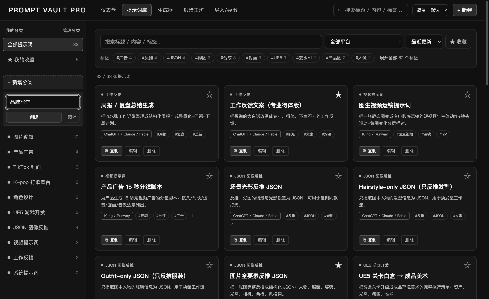

# Prompt Vault Pro · 个人提示词素材库

本地运行的提示词管理工作台：保存、搜索、分类、编辑、复制、组合、导出你的常用 AI 提示词。
覆盖图片编辑、AI 生图、短视频封面、产品广告、UE5 游戏开发、JSON 图像反推、vibe coding 等工作流。

- 技术栈：React 19 + Vite 6 + Tailwind CSS 4（本地素材库无需后端；可选 Firebase 账号登录）
- 提示词和外观数据存在浏览器 / 应用的 localStorage；登录凭据单独加密保存在桌面用户目录
- 桌面版：Electron 打包，Mac（dmg）+ Windows（exe）双端

## 当前版本：v1.0.17

- 新增「账号与设置」页面，Google / GitHub 登录已接入专用 Firebase 项目并完成真实授权验证。Apple 暂未启用，预留配置入口。
- 安装版首次启动默认开启开机自启，可随时关闭；更新不会重置用户已关闭的选择。
- 设置集中提供主题、分类和数据管理入口。快速面板底部也可打开设置。
- 登录凭据由系统安全存储加密，支持退出、取消、超时、离线提示和重启恢复；本机素材库继续支持离线访客使用。
- [账号与设置说明](docs/firebase-auth.md)

此前 v1.0.11：

- 快速面板底部新增「直接插入目标输入框」开关，默认关闭，选择保存在本机。开启后先点击其他应用的输入框，再通过悬浮球或快捷键打开面板，点击提示词会切回捕获的输入框执行粘贴；选中文字时替换选区，不发送 Enter。
- Mac 首次开启需允许辅助功能权限；Windows 使用 UI Automation 和 Ctrl+V，系统可能禁止向管理员权限窗口输入。无法恢复焦点、输入框失效、权限不足时提示词保留在剪贴板，提示手动粘贴。只支持可访问的文本输入控件；网页预览不能向其他应用插入。
- 构建 Mac 版需 Xcode Command Line Tools：构建脚本会将 Swift 插入助手编译为 Intel + Apple Silicon 通用程序。Windows 使用随包提供的 PowerShell / UI Automation 助手，无需额外 npm 自动化依赖。

上一版 v1.0.10：

- 快速面板底部「提示词数据」提供本地 JSON 导出/导入、GitHub Secret Gist 拉取/上传合并。
- 「新增 → 新建分类」直接创建并选中分类，与主窗口同步。
- 桌面面板支持拖动窗口边缘缩放，记住尺寸；网页版可拖动面板右下角调整。
- Gist 首次使用：打开「提示词数据 → Gist 设置」，填写具有 Gists 读写权限的 GitHub 令牌。Gist ID 留空时，首次上传创建 Secret Gist；另一台设备填入同一 ID 即可拉取。令牌由 Electron safeStorage 加密保存于本机，不进入备份。
- Secret Gist 是不公开列出的链接备份，并非访问权限隔离；持有链接的人可以读取。合并按 ID 去重，保留较新的 updatedAt，时间相同保留操作发起端本地内容；分类取并集，同 ID 保留本地属性，不同步删除。先拉取再上传可使两端收敛。

- 快速面板采用搜索优先布局：胶囊标签筛选、紧凑列表/网格、收藏库、按需展开的快速录入，支持明暗切换。
- 快速提示词桌面面板支持按住标题栏自由拖动，可临时固定面板位置，关闭、输入与复制操作保持可用。

- 左侧「+ 新增分类」支持就地输入，回车创建，Esc 取消；创建后自动进入新分类。
- 「管理分类」支持名称、颜色、说明、排序，以及分类栏标题、收藏入口和数量显示设置。
- 三种主题：简洁（默认灰阶）、浅色、霓虹；桌面主窗口、快速面板与悬浮球同步。
- 桌面悬浮球可拖动、固定位置，支持 `Command/Ctrl+Shift+K` 快速唤起。
- JSON 备份包含提示词和分类/外观设置，兼容旧版备份。

详细使用说明：[自定义分类与主题](docs/categories-and-themes.md) · [桌面悬浮球](docs/desktop-floating.md)。

此仓库包含源码、内置示例模板和测试，不包含用户运行时保存的提示词、私密 API 令牌或个人备份；Firebase Web 应用公开配置随客户端提供。公开源码不代表另行授予开源许可证。



---

## 一、如何运行

### 网页版（开发模式）

```bash
cd prompt-vault-pro
npm install
npm run dev
```

打开终端里显示的地址（默认 http://localhost:5177）。

### 桌面版（打安装包）

```bash
npm run dist        # 同时打 Mac + Windows 安装包
npm run dist:mac    # 只打 Mac
npm run dist:win    # 只打 Windows
```

上述快捷命令沿用维护者的外接盘路径。其他电脑可以在安装依赖后，用以下方式输出到项目内的 `release/`：

```bash
npm run build
npx electron-builder --mac --config.directories.output=release  # 在 macOS 上构建
npx electron-builder --win --config.directories.output=release  # 建议在 Windows 上构建
```

macOS 跨平台生成 Windows 安装包还需要可用的 Wine；Apple Silicon 上的 x86_64 Wine 需要 Rosetta 2。v1.0.11 已生成 Mac 和 Windows 安装包；Mac 交互在本机验证，Windows 仍需真机验证。源码同步和本地安装包不代表已发布 GitHub Release。

产物在外接盘 `/Volumes/SN580 1TB Media/开发/PromptVaultPro/release/`（内置盘空间不足，打包输出和临时目录都指向外接盘，打包时必须挂载外接盘）：

| 平台 | 文件 | 说明 |
|---|---|---|
| macOS | `PromptVaultPro-<版本>-mac.dmg` | universal（Intel + Apple Silicon） |
| Windows | `PromptVaultPro-Setup-<版本>-win-x64.exe` | NSIS 安装器 |

Mac 使用本地 ad-hoc 签名，未进行 Developer ID 公证；Windows 未签名。首次启动：

- **macOS**：右键 → 打开（或终端执行 `xattr -cr /Applications/PromptVaultPro.app`）
- **Windows**：SmartScreen 提示时点「更多信息 → 仍要运行」

> 注意：网页版和桌面版的 localStorage 是各自独立的，用「导出 / 导入 JSON」在两边同步数据。

---

## 二、如何新增提示词

三种方式：

1. **手动新建**：导航栏「+ 新建」→ 填标题、分类、平台、标签，以及五个版本的提示词文本（中文 / 英文 / 短版 / 强执行版 / 负面），至少填一个版本。
2. **生成器组合**：「生成器」页 → 选任务类型 → 勾约束条件 → 填补充说明 →「保存到素材库」。
3. **JSON 导入**：见下一节。

提示词文本中可以使用变量占位符（写在花括号里）：

```
{subject} {object} {background} {style} {aspect_ratio}
{reference_image} {target_area} {platform} {tone}
```

也可以自造任何 `{英文变量名}`。保存时系统自动检测变量；在详情页填入变量值即可实时生成最终提示词，复制时自动代入。

---

## 三、如何导入 / 导出

**导出**：仪表盘「⇩ 导出全部」或「导入/导出」页 → 下载 `prompt-vault-export-<日期>.json`。

**导入**：「导入/导出」页点击 / 拖拽 JSON 文件（仪表盘也有入口）。支持两种结构：

```jsonc
// 结构 A：本工具导出的信封格式
{ "app": "prompt-vault-pro", "prompts": [ ... ] }

// 结构 B：裸数组
[ { "title": "...", "chinesePrompt": "..." }, ... ]
```

- 导入是**追加合并**，不会覆盖现有数据
- id 冲突时自动分配新 id
- 缺失字段自动补默认值，不会导致崩溃

**恢复默认模板**：「导入/导出」页红色区域 → 会清空当前所有数据并重置为 33 条内置模板（有二次确认，建议先导出备份）。

---

## 四、如何修改默认模板

内置模板全部在 [src/data/defaultPrompts.js](src/data/defaultPrompts.js)：

- `DEFAULT_PROMPTS`：33 条模板数组，每条一个对象，字段与应用内编辑器一一对应（id / title / category / platform / tags / description / chinesePrompt / englishPrompt / shortPrompt / strongPrompt / negativePrompt / variables / usageNotes / isFavorite / 时间戳）。直接增删改对象即可，`id` 用 `default-0xx` 风格保持唯一。
- `CATEGORIES`：首次使用时的默认分类定义（id / 中文名 / 主题色）。日常新增分类直接使用侧栏「+ 新增分类」；名称、颜色、说明和排序在「管理分类」调整，无需修改代码。
- `PLATFORMS`：平台下拉选项列表。

改完后**已在使用中的数据不会自动更新**（localStorage 优先）；要看到新默认值，去「导入/导出」页执行一次「恢复默认模板」。

生成器的任务类型和约束条件在 [src/utils/promptBuilder.js](src/utils/promptBuilder.js) 的 `TASK_TYPES` / `CONSTRAINTS` 数组里，同样直接加对象即可。

---

## 五、代码结构

```
src/
  main.jsx                    入口
  App.jsx                     全局状态、路由（视图切换）、增删改查、Toast、确认弹窗
  index.css                   Tailwind 4 主题 token + 赛博朋克样式
  data/defaultPrompts.js      默认模板 + 分类 + 平台定义
  utils/storage.js            localStorage 读写、导入导出、剪贴板、时间格式化
  utils/promptBuilder.js      变量系统 + 生成器任务/约束定义与组装
  components/
    Navbar.jsx                顶部导航 + 全局搜索
    Sidebar.jsx               左侧分类栏（移动端为抽屉）
    Dashboard.jsx             仪表盘：统计卡 / 最近使用 / 分类统计 / 快捷操作
    PromptLibrary.jsx         提示词库：筛选工具栏 + 卡片网格 + 空状态
    PromptCard.jsx            单张卡片
    PromptDetailModal.jsx     详情弹窗：版本 tab / 一键复制 / 变量实时代入
    PromptEditorModal.jsx     新建 / 编辑弹窗
    PromptBuilder.jsx         生成器页面
    ImportExportPanel.jsx     导入 / 导出 / 恢复默认页面
    TagFilter.jsx             标签筛选 chips
    Toast.jsx                 右下角提示
electron/
  main.cjs                    Electron 主进程（开发加载 dev server，打包加载 dist/）
```

## 六、验证与版本同步

```bash
npm run build
node --test tests/preferences.test.mjs
```

Electron 交互测试需要可用的 Playwright 模块（如通过 `NODE_PATH` 指向单独安装的位置），测试使用独立的临时用户目录：

```bash
node tests/sidebar-category-smoke.cjs
node tests/categories-theme-smoke.cjs
node tests/quick-panel-smoke.cjs  # macOS 原生拖动、固定、搜索、标签、收藏、录入和主题同步
```

项目仓库为 [FIONN191/prompt-vault-pro](https://github.com/FIONN191/prompt-vault-pro)。每次更新完成并验证后，将相关改动提交并推送到 `main`；个人提示词数据、密钥、依赖和构建产物不进入源码提交。

### v1.0.12：Gemini Voyager JSON 兼容

主界面「数据管理」和快速面板「提示词数据 → 导入」均支持直接选择 Gemini Voyager 原始导出 JSON（`format: gemini-voyager.prompts.v1`、`items` 数组）。保留正文、标签、创建/更新时间，缺标题时取正文前 60 字，归入「Gemini Voyager 导入」分类。英文或中英混合原文存放在正文（中文版）字段，不做翻译。

Voyager 使用稳定的来源 ID，与此前转换版兼容；重复导入仅合并较新的版本，保留收藏和最近使用记录。错误条目会使整份导入失败，避免部分丢失。既有 Prompt Vault 备份、提示词数组和 `prompts` 对象继续支持。

### v1.0.13：直接插入权限恢复

快速面板显示“权限未就绪”时会保留复制功能。可直接打开 macOS 辅助功能设置；返回面板时刷新权限，“授权 / 重新检查”会重启插入助手重新读取系统授权。如果设置中已开启但仍不被认可，关闭再开启 PromptVaultPro 的辅助功能权限后重新检查，必要时完全退出并重开应用。权限由用户在 macOS 设置中授予，应用不会绕过权限。

### v1.0.14：修复 Mac 辅助功能授权身份

Mac 包使用完整的本地 ad-hoc 签名并校验，签名标识与应用包一致（`com.fionn.promptvaultpro`）。修复旧包未封装完整签名时，设置中授权给应用包、插入助手的请求却归属 Electron 可执行文件路径的问题。此签名不等同于 Apple Developer ID 或公证；升级后系统如要求重新授权，请在辅助功能设置中刷新 PromptVaultPro 权限。

若系统设置显示已开启但仍报告未授权，旧授权记录可能绑定旧签名：在辅助功能列表选中 PromptVaultPro，移除该条目，再用「＋」重新添加 `/Applications/PromptVaultPro.app`，保持开启，然后点击面板「授权 / 重新检查」。只刷新此应用的授权，无需清空系统其他权限。2026-10-08 已在用户现有安装上验证该流程，并由用户确认真实聊天输入框可以自动填入。

### v1.0.15：插入后保留快速面板

自动填入后快速面板保持显示，不再收起成悬浮球；键盘焦点交回目标输入框，连续点击面板可以继续插入。仍只粘贴，不按回车发送。需要收起时可点击关闭按钮或在面板中按 Esc。

### 1.0.16：账号与设置

主导航新增「账号与设置」，快速面板底部的「设置」也能进入。支持主题、分类/备份入口、账号状态、退出登录和可关闭的默认开机自启。Mac / Windows 安装版首次启动默认启用自启，以后尊重用户关闭的选择；自启时只显示悬浮球。

账号接入 Firebase Authentication 的 Google、GitHub、Apple 登录，使用系统浏览器授权并加密保存本地会话。需要先配置 Firebase 项目和对应登录提供商；详细步骤、数据边界与验证方式见 [Firebase 登录设置](docs/firebase-auth.md)。未登录仍可使用本地素材库，登录不会自动同步提示词。

### 1.0.17：悬浮球只打开快速面板

macOS 悬浮球不再抢占应用焦点，快速面板使用原生非激活浮动窗口。点击悬浮球时，主窗口保持后台、隐藏或最小化状态；通过「打开提示词库」、设置或 Dock 仍可主动打开主应用。面板搜索、拖动、复制和直接插入继续可用。
